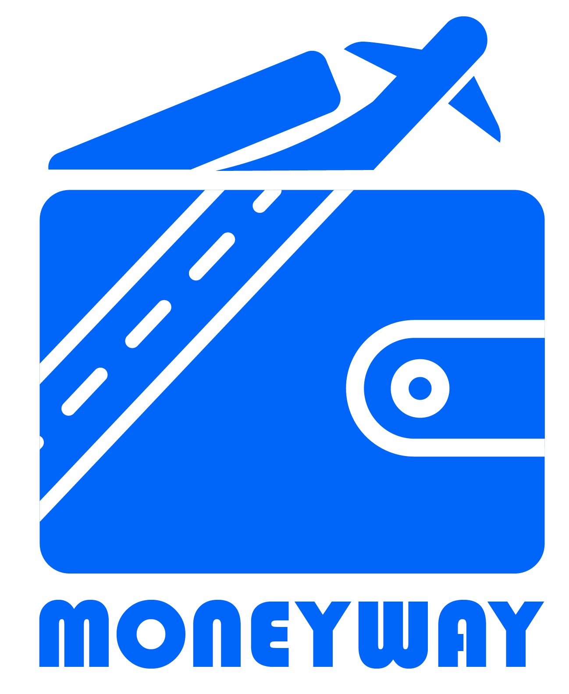

# MONEYWAY

**MONEYWAY**는 TOURAPI와 카카오 API를 활용한 제주도 여행 도우미 서비스입니다.  
여행 예산을 중심으로 사용자 맞춤형 여행 계획 수립을 지원하며, 다양한 기능을 제공합니다.

---

## 주요 기능

- **계획 세우기**  
  사용자가 직접 여행 계획표를 DIY 방식으로 세울 수 있으며, 세운 계획에 따른 예상 예산을 확인할 수 있습니다.

- **계획 세워주기**  
  여행 기간, 예산 등 핵심 정보를 입력하면 자동으로 최적화된 여행 계획을 생성해줍니다.

- **계획 공유**  
  사용자가 만든 여행 계획을 게시판 등에 공유하여 다른 사용자들과 정보를 나눌 수 있습니다.

- **저예산 챌린지**  
  자신이 세운 계획으로 실제 여행을 다녀오고, 경험과 관련 내용을 공유하여 챌린지에 참여할 수 있습니다.

---

## 팀 구성 및 역할

| 역할       | 담당자    |
|------------|-----------|
| 디자인     | 주예원    |
| 프론트엔드 | 김연희, 최지인 |
| 백엔드     | 정재민, 이강현 |

---

## 사용 기술 스택

- **프론트엔드** : React  
- **백엔드** : Spring Boot  
- **디자인** : Figma  

---

## 프로젝트 개요

본 프로젝트는 예산 기반의 제주도 여행 맞춤형 서비스로,  
실제 API 데이터와 사용자 입력을 바탕으로 현실적인 여행 계획을 지원하고,  
커뮤니티를 통한 계획 공유 및 저예산 챌린지를 통해 여행 경험을 풍부하게 합니다.

---

## 설치 및 실행 방법

(프로젝트별 설치, 빌드, 실행 방법 추가 예정)

---

## 라이선스

(프로젝트 라이선스 정보 추가 예정)
